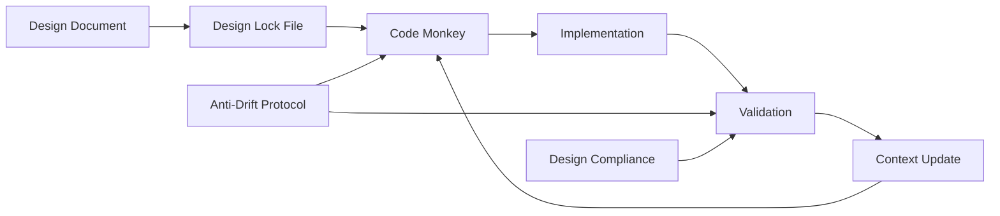

# AI Agent Documentation

This directory contains AI agent systems designed to solve the fundamental problems of AI-assisted coding: context drift, assumption-based failures, and architectural decay.

## The Problem We're Solving

### What Goes Wrong with AI Coding

Through painful experience (see [retrospective](../retrospectives/2025-09-11-command-system-retrospective.md)), we discovered that AI-assisted coding fails in predictable ways:

1. **Context Drift** - During incremental development, each small "reasonable" change compounds into significant deviation from the original design. Like a game of telephone, the final implementation barely resembles the original intent.

2. **Assumption-Based Disasters** - The AI assumes class structures, import paths, and patterns instead of verifying them. Our Command class inheritance disaster is a perfect example: we assumed Command was a base class when it was actually a @dataclass.

3. **Cascade Failures** - One wrong assumption leads to dozens of "fixes" that make things worse. We spent hours fixing TypeErrors that originated from a single wrong assumption.

4. **Memory Loss** - The AI forgets the original goal as it progresses through implementation. Without external memory, it drifts from the design.

### The Root Insight

**"Drift is not a technical problem, it's a memory problem."**

AI assistants don't have persistent memory across increments. Each step is slightly disconnected from the last, leading to gradual deviation. It's like navigating by dead reckoning vs GPS - errors compound without constant course correction.

## Our Solution: External Memory Systems

We've created a multi-layered system that provides persistent external memory and verification:

### 1. Design Lock Files (`.design-lock.yml`)
- Immutable requirements that cannot change during implementation
- Clear success criteria and red flags
- Specific patterns to follow and anti-patterns to avoid

### 2. Implementation Context (`.implementation-context.md`)
- Tracks progress through implementation phases
- Maintains the "North Star" goal at the top
- Records what's done and what's next
- Updated after each successful increment

### 3. The Code Monkey Agent 🐵
- Methodical implementation in ≤10 line increments
- Tests after EVERY change (app must start)
- Reads before writing (no assumptions)
- Follows existing patterns (no creativity)

### 4. Anti-Drift Protocols
- Continuous validation against design
- Hard stops when drift detected
- Context chains between increments
- Pattern verification before implementation

## Agent Configurations

### IMPORTANT: Claude Code Agent Setup
**Claude Code requires agent files to be DIRECTLY in `.claude/agents/` directory:**
- ✅ **CORRECT**: Full agent content copied to `.claude/agents/agent-name.md`
- ❌ **WRONG**: Pointer/redirect files that reference other locations
- ❌ **WRONG**: Symlinks to files in docs/agents/

**To set up agents for Claude Code:**
```bash
# Copy agent to Claude Code's expected location
cp docs/agents/code-monkey.md .claude/agents/code-monkey.md
cp docs/agents/design-compliance.md .claude/agents/design-compliance.md
```

The files in `docs/agents/` serve as reference documentation, while `.claude/agents/` contains the active configurations that Claude Code actually uses.

### Primary Implementation Agent
- **[code-monkey.md](code-monkey.md)** 🐵 - The Code Monkey: careful, methodical implementation agent
  - Maximum 10 lines per change
  - Test after every change
  - Never assumes, always verifies
  - "Small steps, no breaks, always test!"
  - **Active location**: `.claude/agents/code-monkey.md` (for Claude Code)
  - **Reference location**: `docs/agents/code-monkey.md` (for documentation)

### Design Verification Agents
- **[design-compliance.md](design-compliance.md)** - Verifies implementation matches design
- **[design-compliance-analyzer.md](design-compliance-analyzer.md)** - Advanced design analysis
- **[design-compliance-instructions.md](design-compliance-instructions.md)** - Detailed verification instructions

### Protocols and Strategies
- **[anti-drift-protocol.md](anti-drift-protocol.md)** - Prevents context drift during development
- **[CONTEXT_DRIFT_PREVENTION.md](CONTEXT_DRIFT_PREVENTION.md)** - Comprehensive drift prevention strategy
- **[INTELLIGENT_CODER_AGENT_PROPOSAL.md](INTELLIGENT_CODER_AGENT_PROPOSAL.md)** - Three-tier agent architecture

## How These Agents Work Together



1. **Start**: Create design lock file from design document
2. **Implement**: Code Monkey reads lock file and context
3. **Validate**: Every change tested immediately
4. **Verify**: Design compliance checks for drift
5. **Update**: Context file tracks progress
6. **Repeat**: Continue with next increment

## Lessons Learned

### The Command Class Disaster
We assumed `Command` was a base class and created inherited classes. It was actually a `@dataclass`. This single wrong assumption led to:
- Hours of debugging TypeErrors
- Complete reimplementation 
- Breaking working features
- Loss of confidence in the system

**Lesson**: ALWAYS read the actual code. NEVER assume.

### The Speed Trap
We prioritized task completion over working software. Moving fast led to:
- Broken commits
- Cascading failures
- More time fixing than implementing
- Architectural violations

**Lesson**: "A working application with 50% of features is infinitely more valuable than a broken application with 100% of features."

### The Pattern Violation
We created new patterns instead of following existing ones:
- Class-based commands when the codebase used function handlers
- Wrong import paths (core.services instead of services)
- New inheritance hierarchies

**Lesson**: Follow existing patterns religiously. The codebase has reasons for its choices.

## Success Metrics

An implementation is successful when:

1. **Zero Broken Commits** - Every single commit has a working application
2. **Design Fidelity** - Implementation matches original design intent
3. **No Architectural Decay** - Patterns remain consistent
4. **Incremental Progress** - Visible progress in small steps
5. **Full Traceability** - Can trace every line back to a requirement

## Key Concepts

### 1. Safe Implementation
**"First, do no harm"** applied to code. Every agent must:
- Verify before assuming
- Test after every change
- Commit only working code
- Maintain architectural integrity

### 2. External Memory
Design locks, context files, and validation scripts serve as persistent memory that prevents drift.

### 3. Incremental Development
Maximum 10 lines at a time. This isn't a suggestion - it's a hard rule that prevents cascade failures.

### 4. Pattern Recognition
Follow existing patterns exactly. Don't improve, don't optimize, don't be creative. Just follow.

## Usage

### For Claude Code
1. When user says "Code monkey, implement [feature]", use the Code Monkey agent
2. Agent reads design lock and context files
3. Implements incrementally with constant testing
4. Updates context after each success

### For Developers
1. Create design lock file before implementation
2. Initialize implementation context
3. Use Code Monkey for safe implementation
4. Run design compliance checks regularly
5. Update context file as you progress

## Philosophy

The agent system embodies hard-won lessons:

- **Correctness over speed** - Slow and right beats fast and broken
- **Working over complete** - Partial success beats total failure  
- **Verification over assumption** - Read the code, don't guess
- **Incremental over revolutionary** - Small steps prevent big falls

## The GPS Analogy

Traditional AI coding is like navigating by dead reckoning - each step's error compounds until you're completely lost.

Our agent system is like GPS navigation - constant course correction, always knowing where you are, and immediately detecting when you're off course.

## Final Words

These aren't just prompts or templates. They're complete systems with:
- External memory (design locks, context files)
- Verification protocols (compliance checks)
- Hard stops (red flags that halt progress)
- Learning mechanisms (retrospectives and improvements)

They exist because we learned the hard way that AI coding without these safeguards leads to disaster. With them, we can harness AI's power while avoiding its pitfalls.

Remember: **The Code Monkey is slow, but it never falls.** 🐵