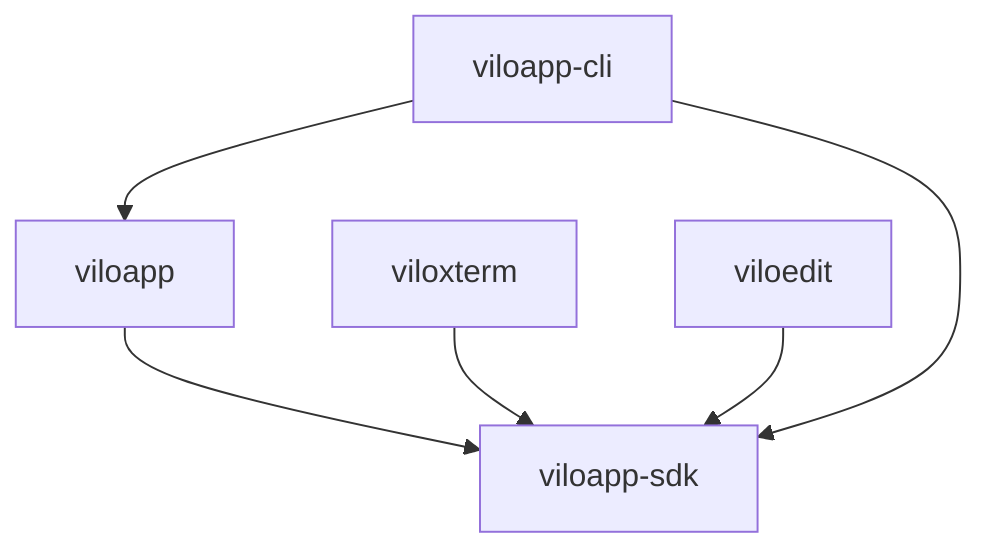

# ViloxTerm Monorepo Package Structure

## Overview

ViloxTerm is organized as a monorepo containing the main application, SDK, plugins, and CLI tools. Each package is independently versioned and has clear boundaries and dependencies.

## Package Architecture

```
packages/
├── viloapp/              # Main application
├── viloapp-sdk/          # Plugin SDK and interfaces
├── viloxterm/            # Terminal plugin
├── viloedit/             # Editor plugin
└── viloapp-cli/          # CLI development tools
```

## Package Descriptions

### viloapp (Main Application)
**Purpose**: Core application that hosts plugins and provides the main UI shell

**Structure**:
```
packages/viloapp/
├── pyproject.toml
├── src/
│   └── viloapp/
│       ├── __init__.py
│       ├── main.py              # Application entry point
│       ├── core/                # Core functionality
│       │   ├── commands/        # Command system
│       │   ├── plugin_system/   # Plugin infrastructure
│       │   ├── settings/        # Settings management
│       │   └── themes/          # Theme system
│       ├── services/            # Service layer
│       │   ├── base.py         # Service base class
│       │   ├── service_locator.py
│       │   ├── plugin_service.py
│       │   └── workspace_service.py
│       ├── ui/                  # User interface
│       │   ├── main_window.py
│       │   ├── widgets/
│       │   └── dialogs/
│       ├── controllers/         # UI controllers
│       └── models/              # Data models
└── tests/                       # Application tests
```

**Dependencies**:
- PySide6 (UI framework)
- viloapp-sdk (plugin interfaces)
- Standard library modules

**Exports**: Main application class, service interfaces (for testing)

### viloapp-sdk (Plugin SDK)
**Purpose**: Provides interfaces, base classes, and utilities for plugin development

**Structure**:
```
packages/viloapp-sdk/
├── pyproject.toml
├── src/
│   └── viloapp_sdk/
│       ├── __init__.py
│       ├── plugin.py           # IPlugin interface
│       ├── widget.py           # IWidget interface
│       ├── interfaces.py       # All interfaces
│       ├── decorators.py       # Plugin decorators
│       ├── testing/            # Test utilities
│       └── utils/              # Helper utilities
└── tests/
```

**Dependencies**:
- PySide6 (for widget interfaces)
- typing-extensions (for type hints)

**Exports**:
- `IPlugin` - Plugin interface
- `IWidget` - Widget interface
- `IMetadata` - Metadata interface
- `@plugin_command` - Command decorator
- Testing utilities for plugin tests

### viloxterm (Terminal Plugin)
**Purpose**: Provides terminal emulation functionality

**Structure**:
```
packages/viloxterm/
├── pyproject.toml
├── plugin.json                 # Plugin manifest
├── src/
│   └── viloxterm/
│       ├── __init__.py
│       ├── plugin.py           # Plugin implementation
│       ├── widget.py           # Terminal widget
│       └── features/           # Terminal features
│           ├── pty_handler.py
│           └── ansi_parser.py
└── tests/
```

**Dependencies**:
- viloapp-sdk (plugin interfaces)
- PySide6 (UI components)

**Provides**:
- Terminal widget
- PTY handling
- ANSI escape sequence support
- Terminal commands

### viloedit (Editor Plugin)
**Purpose**: Provides text editing functionality

**Structure**:
```
packages/viloedit/
├── pyproject.toml
├── plugin.json                 # Plugin manifest
├── src/
│   └── viloedit/
│       ├── __init__.py
│       ├── plugin.py           # Plugin implementation
│       ├── widget.py           # Editor widget
│       └── features/           # Editor features
│           ├── syntax_highlighter.py
│           └── completion.py
└── tests/
```

**Dependencies**:
- viloapp-sdk (plugin interfaces)
- PySide6 (UI components)

**Provides**:
- Text editor widget
- Syntax highlighting
- Code completion
- Editor commands

### viloapp-cli (CLI Tools)
**Purpose**: Development and management tools for ViloxTerm

**Structure**:
```
packages/viloapp-cli/
├── pyproject.toml
├── src/
│   └── viloapp_cli/
│       ├── __init__.py
│       ├── main.py            # CLI entry point
│       ├── commands/          # CLI commands
│       │   ├── plugin.py      # Plugin management
│       │   ├── build.py       # Build commands
│       │   └── dev.py         # Development tools
│       └── utils/
└── tests/
```

**Dependencies**:
- click (CLI framework)
- viloapp-sdk (for plugin validation)

**Provides**:
- `viloapp plugin create` - Create new plugin
- `viloapp plugin validate` - Validate plugin
- `viloapp build` - Build application
- `viloapp dev` - Development server

## Dependency Rules

### Allowed Dependencies



### Forbidden Dependencies

1. **Plugins MUST NOT depend on**:
   - The main application (viloapp)
   - Other plugins
   - Internal application modules

2. **SDK MUST NOT depend on**:
   - The main application
   - Any plugins
   - Only external dependencies allowed

3. **Main app MUST NOT directly import from**:
   - Plugin internal modules
   - Only through SDK interfaces

## Import Conventions

### Main Application
```python
# Internal imports use full package path
from viloapp.core.commands import execute_command
from viloapp.services.workspace_service import WorkspaceService
from viloapp.ui.widgets import SplitPane

# SDK imports
from viloapp_sdk import IPlugin, IWidget
```

### Plugins
```python
# SDK imports
from viloapp_sdk import IPlugin, IWidget, plugin_command
from viloapp_sdk.testing import PluginTestCase

# Internal plugin imports (relative)
from .widget import TerminalWidget
from .features.pty_handler import PtyHandler
```

### SDK
```python
# Only standard library and external deps
from typing import Protocol, Optional
from PySide6.QtWidgets import QWidget

# Internal SDK imports (relative)
from .interfaces import IMetadata
from .utils.validators import validate_manifest
```

## Development Workflow

### Setting Up Development Environment
```bash
# Clone repository
git clone https://github.com/viloapp/viloxterm.git
cd viloxterm

# Install development dependencies
make setup

# Run in development mode
make dev
```

### Working on Packages

#### Main Application
```bash
cd packages/viloapp
pip install -e .  # Install in editable mode
pytest tests/     # Run tests
```

#### Plugins
```bash
cd packages/viloxterm
pip install -e .  # Install in editable mode
pytest tests/     # Run tests

# Validate plugin
viloapp plugin validate .
```

#### SDK
```bash
cd packages/viloapp-sdk
pip install -e .  # Install in editable mode
pytest tests/     # Run tests
```

### Creating New Plugins
```bash
# Use CLI tool
viloapp plugin create my-plugin

# Or manually:
# 1. Create package structure
# 2. Implement IPlugin interface
# 3. Create plugin.json manifest
# 4. Add to packages/ directory
```

## Build and Release

### Package Versioning
Each package maintains its own version in `pyproject.toml`:
- viloapp: Application version (e.g., 1.0.0)
- viloapp-sdk: SDK version (e.g., 0.5.0)
- Plugins: Individual versions

### Building Packages
```bash
# Build all packages
make build

# Build specific package
cd packages/viloapp
python -m build

# Build application bundle
make bundle  # Creates distributable app
```

### Publishing
```bash
# Publish SDK to PyPI (for external plugin developers)
cd packages/viloapp-sdk
python -m twine upload dist/*

# Application and plugins bundled together
make release  # Creates full release package
```

## Testing Strategy

### Unit Tests
Each package has its own test suite:
```bash
# Run all tests
make test

# Run package-specific tests
pytest packages/viloapp/tests
pytest packages/viloxterm/tests
pytest packages/viloapp-sdk/tests
```

### Integration Tests
Test plugin integration with main app:
```bash
pytest tests/integration/test_plugin_loading.py
pytest tests/integration/test_plugin_commands.py
```

### End-to-End Tests
Full application testing:
```bash
pytest tests/e2e/test_application_flow.py
```

## Plugin Discovery

Plugins are discovered from multiple locations:

1. **Bundled Plugins** (`packages/`):
   - Included with application
   - Always available

2. **User Plugins** (`~/.viloapp/plugins/`):
   - User-installed plugins
   - Loaded after bundled plugins

3. **Development Plugins** (`./dev-plugins/`):
   - For plugin development
   - Only loaded in dev mode

## Security Boundaries

### Plugin Sandboxing
- Plugins run in restricted environment
- Limited file system access
- No network access without permission
- Resource usage monitoring

### API Access Control
- Plugins access app through SDK interfaces only
- Service proxy validates all calls
- Commands require registration
- Events are filtered

## Best Practices

### For Application Development
1. Keep core minimal - push features to plugins
2. Use services for business logic
3. Commands for all user actions
4. Maintain clean interfaces

### For Plugin Development
1. Follow SDK interfaces strictly
2. Handle errors gracefully
3. Provide comprehensive metadata
4. Write tests using SDK utilities
5. Document commands and features

### For SDK Development
1. Maintain backward compatibility
2. Provide migration guides for breaking changes
3. Keep interfaces minimal and focused
4. Include comprehensive testing utilities

## Migration Guide

### From Monolithic to Package Structure

1. **Update imports**:
   ```python
   # Old
   from ui.widgets import MyWidget
   from core.commands import execute_command

   # New
   from viloapp.ui.widgets import MyWidget
   from viloapp.core.commands import execute_command
   ```

2. **Update file paths**:
   ```python
   # Old
   config_file = "configs/settings.json"

   # New
   from importlib.resources import files
   config_file = files('viloapp') / 'configs' / 'settings.json'
   ```

3. **Update test imports**:
   ```python
   # Old
   from tests.helpers import create_test_app

   # New
   from viloapp.tests.helpers import create_test_app
   ```

## Troubleshooting

### Common Issues

1. **Import errors after reorganization**:
   - Check PYTHONPATH includes packages/
   - Ensure packages installed in editable mode
   - Verify __init__.py files exist

2. **Plugin not discovered**:
   - Check plugin.json validity
   - Verify plugin in correct directory
   - Check plugin ID is unique

3. **Build failures**:
   - Update dependencies in pyproject.toml
   - Clear build caches
   - Check version conflicts

### Debug Commands

```bash
# Check package structure
viloapp debug structure

# List discovered plugins
viloapp plugin list

# Validate package dependencies
viloapp debug deps

# Check import paths
python -c "import viloapp; print(viloapp.__file__)"
```

## Future Enhancements

1. **Plugin marketplace**: Central repository for community plugins
2. **Plugin signing**: Cryptographic verification of plugins
3. **Hot reload**: Development mode plugin reloading
4. **Remote plugins**: Load plugins from URLs
5. **Plugin dependencies**: Inter-plugin dependencies support