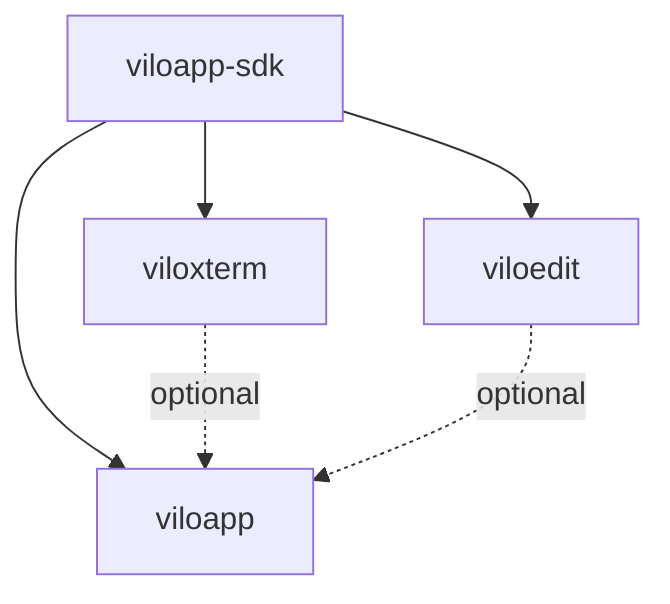

# Monorepo Package Structure Documentation

## Overview
This document details the proposed monorepo structure for ViloxTerm's plugin-based architecture refactoring, including directory layout, package configurations, and build/deployment strategies.

## Directory Structure

```
viloapp/                           # Root monorepo directory
├── pyproject.toml                 # Root workspace configuration
├── Makefile                       # Monorepo-wide build commands
├── .github/                       # CI/CD workflows
│   └── workflows/
│       ├── test.yml              # Test all packages
│       ├── release.yml           # Release workflow
│       └── publish.yml           # PyPI publishing
│
├── packages/                      # All packages directory
│   │
│   ├── viloapp/                  # Main application package
│   │   ├── pyproject.toml
│   │   ├── src/
│   │   │   └── viloapp/
│   │   │       ├── __init__.py
│   │   │       ├── main.py
│   │   │       ├── core/
│   │   │       │   ├── plugin_host.py
│   │   │       │   ├── plugin_manager.py
│   │   │       │   └── plugin_registry.py
│   │   │       ├── services/
│   │   │       ├── ui/
│   │   │       └── resources/
│   │   └── tests/
│   │
│   ├── viloapp-sdk/              # Plugin SDK package
│   │   ├── pyproject.toml
│   │   ├── src/
│   │   │   └── viloapp_sdk/
│   │   │       ├── __init__.py
│   │   │       ├── plugin.py    # IPlugin interface
│   │   │       ├── widget.py    # IWidget interface
│   │   │       ├── services.py  # Service interfaces
│   │   │       ├── events.py    # Event system
│   │   │       └── types.py     # Type definitions
│   │   └── tests/
│   │
│   ├── viloxterm/                # Terminal plugin package
│   │   ├── pyproject.toml
│   │   ├── src/
│   │   │   └── viloxterm/
│   │   │       ├── __init__.py
│   │   │       ├── plugin.py
│   │   │       ├── terminal_widget.py
│   │   │       ├── terminal_server.py
│   │   │       ├── backends/
│   │   │       └── assets/
│   │   └── tests/
│   │
│   └── viloedit/                 # Editor plugin package
│       ├── pyproject.toml
│       ├── src/
│       │   └── viloedit/
│       │       ├── __init__.py
│       │       ├── plugin.py
│       │       ├── editor_widget.py
│       │       ├── syntax/
│       │       └── themes/
│       └── tests/
│
├── scripts/                       # Build and development scripts
│   ├── build.py
│   ├── release.py
│   └── dev-setup.py
│
└── docs/                         # Documentation
    ├── architecture/
    ├── plugin-development/
    └── api/
```

## Package Configurations

### Root Workspace (pyproject.toml)

```toml
[build-system]
requires = ["hatchling"]
build-backend = "hatchling.build"

[project]
name = "viloapp-workspace"
version = "0.0.1"
description = "ViloxTerm monorepo workspace"

[tool.hatch]
# Workspace configuration
[tool.hatch.build]
packages = [
    "packages/viloapp",
    "packages/viloapp-sdk",
    "packages/viloxterm",
    "packages/viloedit"
]

[tool.pytest]
testpaths = ["packages/*/tests"]

[tool.ruff]
src = ["packages/*/src"]
extend-include = ["packages/*/tests/*.py"]

[tool.mypy]
packages = ["viloapp", "viloapp_sdk", "viloxterm", "viloedit"]
namespace_packages = true
```

### viloapp Package (packages/viloapp/pyproject.toml)

```toml
[build-system]
requires = ["setuptools>=61.0", "wheel"]
build-backend = "setuptools.build_meta"

[project]
name = "viloapp"
version = "2.0.0"
description = "ViloxTerm - Extensible Terminal Application"
authors = [{name = "ViloxTerm Team", email = "team@viloxterm.org"}]
readme = "README.md"
license = {text = "MIT"}
requires-python = ">=3.8"
classifiers = [
    "Development Status :: 4 - Beta",
    "Environment :: X11 Applications :: Qt",
    "Intended Audience :: Developers",
    "License :: OSI Approved :: MIT License",
    "Programming Language :: Python :: 3",
    "Programming Language :: Python :: 3.8",
    "Programming Language :: Python :: 3.9",
    "Programming Language :: Python :: 3.10",
    "Programming Language :: Python :: 3.11",
    "Topic :: Software Development",
    "Topic :: Terminals",
]

dependencies = [
    "PySide6>=6.5.0",
    "viloapp-sdk>=1.0.0",
    "pyyaml>=6.0",
    "toml>=0.10.2",
    "platformdirs>=3.0.0",
]

[project.optional-dependencies]
dev = [
    "pytest>=7.0",
    "pytest-qt>=4.2.0",
    "pytest-cov>=4.0",
    "black>=23.0",
    "ruff>=0.1.0",
    "mypy>=1.0",
]

full = [
    "viloxterm>=1.0.0",
    "viloedit>=1.0.0",
]

[project.scripts]
viloapp = "viloapp.main:main"
viloxterm = "viloapp.main:main"  # Backward compatibility

[project.gui-scripts]
viloapp-gui = "viloapp.main:main"

[project.entry-points."viloapp.plugins"]
# Built-in plugins can be registered here
core = "viloapp.plugins.core:CorePlugin"

[tool.setuptools]
package-dir = {"": "src"}
packages = ["viloapp"]

[tool.setuptools.package-data]
viloapp = [
    "resources/**/*",
    "themes/**/*",
    "icons/**/*",
]
```

### viloapp-sdk Package (packages/viloapp-sdk/pyproject.toml)

```toml
[build-system]
requires = ["setuptools>=61.0", "wheel"]
build-backend = "setuptools.build_meta"

[project]
name = "viloapp-sdk"
version = "1.0.0"
description = "ViloxTerm Plugin SDK"
authors = [{name = "ViloxTerm Team", email = "team@viloxterm.org"}]
readme = "README.md"
license = {text = "MIT"}
requires-python = ">=3.8"
classifiers = [
    "Development Status :: 5 - Production/Stable",
    "Intended Audience :: Developers",
    "License :: OSI Approved :: MIT License",
    "Programming Language :: Python :: 3",
    "Topic :: Software Development :: Libraries",
]

dependencies = [
    "PySide6>=6.5.0",
    "typing-extensions>=4.0.0",
]

[project.optional-dependencies]
dev = [
    "pytest>=7.0",
    "pytest-qt>=4.2.0",
    "mypy>=1.0",
    "sphinx>=5.0",
    "sphinx-autodoc-typehints>=1.0",
]

[tool.setuptools]
package-dir = {"": "src"}
packages = ["viloapp_sdk"]
```

### viloxterm Package (packages/viloxterm/pyproject.toml)

```toml
[build-system]
requires = ["setuptools>=61.0", "wheel"]
build-backend = "setuptools.build_meta"

[project]
name = "viloxterm"
version = "1.0.0"
description = "Terminal Plugin for ViloxTerm"
authors = [{name = "ViloxTerm Team", email = "team@viloxterm.org"}]
readme = "README.md"
license = {text = "MIT"}
requires-python = ">=3.8"
classifiers = [
    "Development Status :: 4 - Beta",
    "Environment :: X11 Applications :: Qt",
    "Intended Audience :: Developers",
    "License :: OSI Approved :: MIT License",
    "Programming Language :: Python :: 3",
    "Topic :: Terminals",
]

dependencies = [
    "viloapp-sdk>=1.0.0",
    "PySide6>=6.5.0",
    "flask>=2.0.0",
    "flask-socketio>=5.0.0",
    "python-socketio>=5.0.0",
    "pyte>=0.8.0",
]

[project.optional-dependencies]
windows = [
    "pywinpty>=2.0.0",
]
dev = [
    "pytest>=7.0",
    "pytest-qt>=4.2.0",
    "pytest-asyncio>=0.21.0",
]

[project.entry-points."viloapp.plugins"]
terminal = "viloxterm.plugin:TerminalPlugin"

[tool.setuptools]
package-dir = {"": "src"}
packages = ["viloxterm"]

[tool.setuptools.package-data]
viloxterm = [
    "assets/**/*",
    "themes/**/*",
]
```

### viloedit Package (packages/viloedit/pyproject.toml)

```toml
[build-system]
requires = ["setuptools>=61.0", "wheel"]
build-backend = "setuptools.build_meta"

[project]
name = "viloedit"
version = "1.0.0"
description = "Code Editor Plugin for ViloxTerm"
authors = [{name = "ViloxTerm Team", email = "team@viloxterm.org"}]
readme = "README.md"
license = {text = "MIT"}
requires-python = ">=3.8"
classifiers = [
    "Development Status :: 4 - Beta",
    "Environment :: X11 Applications :: Qt",
    "Intended Audience :: Developers",
    "License :: OSI Approved :: MIT License",
    "Programming Language :: Python :: 3",
    "Topic :: Text Editors",
]

dependencies = [
    "viloapp-sdk>=1.0.0",
    "PySide6>=6.5.0",
    "Pygments>=2.0.0",
    "tree-sitter>=0.20.0",
]

[project.optional-dependencies]
lsp = [
    "pylsp>=1.0.0",
    "python-lsp-jsonrpc>=1.0.0",
]
dev = [
    "pytest>=7.0",
    "pytest-qt>=4.2.0",
]

[project.entry-points."viloapp.plugins"]
editor = "viloedit.plugin:EditorPlugin"

[tool.setuptools]
package-dir = {"": "src"}
packages = ["viloedit"]

[tool.setuptools.package-data]
viloedit = [
    "themes/**/*",
    "syntax/**/*",
]
```

## Development Workflow

### Initial Setup

```bash
# Clone the monorepo
git clone https://github.com/viloxterm/viloapp.git
cd viloapp

# Run development setup script
python scripts/dev-setup.py

# Or manually:
pip install -e packages/viloapp-sdk
pip install -e packages/viloxterm
pip install -e packages/viloedit
pip install -e "packages/viloapp[dev]"
```

### Development Commands

```makefile
# Root Makefile
.PHONY: setup dev test build release clean

# Setup development environment
setup:
	python scripts/dev-setup.py

# Run in development mode
dev:
	cd packages/viloapp && python -m viloapp --dev

# Test all packages
test:
	pytest packages/*/tests

# Test specific package
test-sdk:
	pytest packages/viloapp-sdk/tests

test-terminal:
	pytest packages/viloxterm/tests

test-editor:
	pytest packages/viloedit/tests

test-app:
	pytest packages/viloapp/tests

# Build all packages
build:
	python scripts/build.py

# Format code
format:
	black packages/*/src
	ruff --fix packages/*/src

# Type check
typecheck:
	mypy packages/*/src

# Clean build artifacts
clean:
	find . -type d -name "__pycache__" -exec rm -rf {} +
	find . -type d -name "*.egg-info" -exec rm -rf {} +
	rm -rf dist/ build/
```

## Build and Release Process

### Build Script (scripts/build.py)

```python
#!/usr/bin/env python3
"""Build all packages in the monorepo."""

import subprocess
import sys
from pathlib import Path

PACKAGES = [
    "viloapp-sdk",
    "viloxterm",
    "viloedit",
    "viloapp",
]

def build_package(package_dir: Path):
    """Build a single package."""
    print(f"Building {package_dir.name}...")
    result = subprocess.run(
        [sys.executable, "-m", "build"],
        cwd=package_dir,
        capture_output=True,
        text=True
    )
    if result.returncode != 0:
        print(f"Failed to build {package_dir.name}")
        print(result.stderr)
        return False
    return True

def main():
    """Build all packages in dependency order."""
    root = Path(__file__).parent.parent
    packages_dir = root / "packages"

    for package in PACKAGES:
        package_dir = packages_dir / package
        if not build_package(package_dir):
            sys.exit(1)

    print("All packages built successfully!")

if __name__ == "__main__":
    main()
```

### Release Script (scripts/release.py)

```python
#!/usr/bin/env python3
"""Release packages to PyPI."""

import subprocess
import sys
from pathlib import Path
import toml

PACKAGES = [
    "viloapp-sdk",
    "viloxterm",
    "viloedit",
    "viloapp",
]

def get_version(package_dir: Path) -> str:
    """Get package version from pyproject.toml."""
    pyproject = toml.load(package_dir / "pyproject.toml")
    return pyproject["project"]["version"]

def check_versions():
    """Ensure all packages have consistent versions."""
    root = Path(__file__).parent.parent
    packages_dir = root / "packages"

    versions = {}
    for package in PACKAGES:
        package_dir = packages_dir / package
        versions[package] = get_version(package_dir)

    # SDK should be stable
    sdk_version = versions["viloapp-sdk"]

    # Check that main app depends on correct SDK version
    app_pyproject = toml.load(packages_dir / "viloapp" / "pyproject.toml")
    deps = app_pyproject["project"]["dependencies"]

    sdk_dep = next(d for d in deps if d.startswith("viloapp-sdk"))
    if f">={sdk_version}" not in sdk_dep:
        print(f"Warning: viloapp depends on {sdk_dep} but SDK is {sdk_version}")
        return False

    return True

def publish_package(package_dir: Path, test: bool = True):
    """Publish package to PyPI."""
    repo = "--repository testpypi" if test else ""

    result = subprocess.run(
        f"twine upload {repo} dist/*",
        shell=True,
        cwd=package_dir,
        capture_output=True,
        text=True
    )

    return result.returncode == 0

def main():
    """Release all packages in dependency order."""
    import argparse

    parser = argparse.ArgumentParser()
    parser.add_argument("--prod", action="store_true", help="Release to production PyPI")
    args = parser.parse_args()

    if not check_versions():
        print("Version check failed!")
        sys.exit(1)

    root = Path(__file__).parent.parent
    packages_dir = root / "packages"

    for package in PACKAGES:
        package_dir = packages_dir / package
        print(f"Publishing {package}...")

        if not publish_package(package_dir, test=not args.prod):
            print(f"Failed to publish {package}")
            sys.exit(1)

    print("All packages published successfully!")

if __name__ == "__main__":
    main()
```

## CI/CD Configuration

### GitHub Actions Workflow (.github/workflows/test.yml)

```yaml
name: Test

on:
  push:
    branches: [main, develop]
  pull_request:
    branches: [main]

jobs:
  test:
    runs-on: ${{ matrix.os }}
    strategy:
      matrix:
        os: [ubuntu-latest, windows-latest, macos-latest]
        python-version: ["3.8", "3.9", "3.10", "3.11"]

    steps:
    - uses: actions/checkout@v3

    - name: Set up Python
      uses: actions/setup-python@v4
      with:
        python-version: ${{ matrix.python-version }}

    - name: Install Qt dependencies (Linux)
      if: runner.os == 'Linux'
      run: |
        sudo apt-get update
        sudo apt-get install -y libgl1-mesa-glx libxkbcommon-x11-0

    - name: Install dependencies
      run: |
        pip install --upgrade pip
        pip install pytest pytest-qt pytest-cov
        python scripts/dev-setup.py

    - name: Run tests
      run: |
        pytest packages/*/tests --cov=packages --cov-report=xml

    - name: Upload coverage
      uses: codecov/codecov-action@v3
      with:
        file: ./coverage.xml
```

### Release Workflow (.github/workflows/release.yml)

```yaml
name: Release

on:
  push:
    tags:
      - 'v*'

jobs:
  release:
    runs-on: ubuntu-latest

    steps:
    - uses: actions/checkout@v3

    - name: Set up Python
      uses: actions/setup-python@v4
      with:
        python-version: '3.11'

    - name: Install build dependencies
      run: |
        pip install --upgrade pip
        pip install build twine

    - name: Build packages
      run: python scripts/build.py

    - name: Publish to PyPI
      env:
        TWINE_USERNAME: __token__
        TWINE_PASSWORD: ${{ secrets.PYPI_API_TOKEN }}
      run: python scripts/release.py --prod

    - name: Create GitHub Release
      uses: softprops/action-gh-release@v1
      with:
        files: packages/*/dist/*
        generate_release_notes: true
```

## Package Dependencies Graph



## Version Management Strategy

### Semantic Versioning
- **viloapp-sdk**: Stable API (1.x.x) - Breaking changes require major version bump
- **viloapp**: Application version (2.x.x) - User-facing features drive versioning
- **viloxterm/viloedit**: Plugin versions (1.x.x) - Independent versioning

### Version Compatibility Matrix

| viloapp | viloapp-sdk | viloxterm | viloedit |
|---------|-------------|-----------|----------|
| 2.0.x   | >=1.0.0     | >=1.0.0   | >=1.0.0  |
| 2.1.x   | >=1.0.0     | >=1.0.0   | >=1.0.0  |
| 3.0.x   | >=2.0.0     | >=2.0.0   | >=2.0.0  |

## Migration from Current Structure

### Phase 1: Prepare Current Codebase
1. Ensure all tests pass
2. Document current architecture
3. Create migration branch

### Phase 2: Create Package Structure
1. Create packages/ directory
2. Move code into appropriate packages
3. Update imports to use new structure

### Phase 3: Update Build System
1. Create pyproject.toml for each package
2. Update CI/CD pipelines
3. Test build process

### Phase 4: Release
1. Release viloapp-sdk first
2. Release plugins (viloxterm, viloedit)
3. Release main application
4. Update documentation

## Development Tools Integration

### VS Code Workspace

```json
{
    "folders": [
        {"path": "packages/viloapp", "name": "viloapp"},
        {"path": "packages/viloapp-sdk", "name": "sdk"},
        {"path": "packages/viloxterm", "name": "terminal"},
        {"path": "packages/viloedit", "name": "editor"}
    ],
    "settings": {
        "python.linting.enabled": true,
        "python.linting.pylintEnabled": false,
        "python.linting.ruffEnabled": true,
        "python.formatting.provider": "black",
        "python.testing.pytestEnabled": true,
        "python.testing.unittestEnabled": false
    }
}
```

### PyCharm Project Structure

```xml
<!-- .idea/modules.xml -->
<modules>
    <module fileurl="file://$PROJECT_DIR$/packages/viloapp/.idea/viloapp.iml" />
    <module fileurl="file://$PROJECT_DIR$/packages/viloapp-sdk/.idea/sdk.iml" />
    <module fileurl="file://$PROJECT_DIR$/packages/viloxterm/.idea/terminal.iml" />
    <module fileurl="file://$PROJECT_DIR$/packages/viloedit/.idea/editor.iml" />
</modules>
```

## Summary

This monorepo structure provides:

1. **Clear Separation**: Each component in its own package
2. **Dependency Management**: Explicit dependencies between packages
3. **Development Efficiency**: Easy local development with editable installs
4. **Release Flexibility**: Independent versioning and releases
5. **Testing**: Comprehensive test coverage across all packages
6. **Documentation**: Centralized documentation with per-package READMEs
7. **CI/CD**: Automated testing and release pipelines
8. **Tooling**: Integration with popular development tools

The structure maintains development cohesion while enabling modular distribution and plugin ecosystem growth.