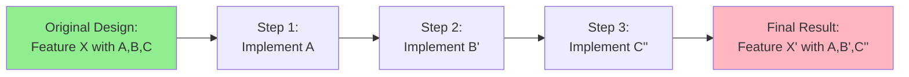
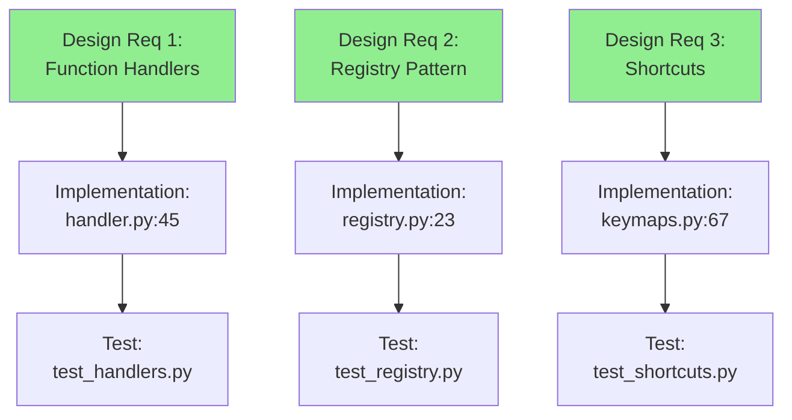
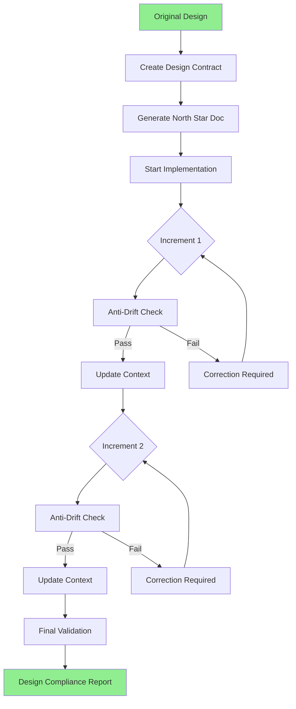

# Context Drift Prevention in Incremental Development

**Date:** 2025-09-11  
**Problem:** Incremental changes lead to drift from original design intent  
**Impact:** Features become different from what was originally specified

---

## The Context Drift Problem

### How Drift Occurs



Each incremental step makes small "reasonable" adjustments that compound into significant deviation.

### Real Example from Our Codebase

**Original Design:** Command system with Registry/Executor separation  
**What Happened:**
1. Step 1: Created commands ✓
2. Step 2: "Simplified" by inheriting from Command (drift!)
3. Step 3: "Fixed" imports with wrong paths (more drift!)
4. Result: Broken system that didn't match design

---

## Solution 1: Design Anchoring System

### Concept: Immutable Design Contract

```python
class DesignContract:
    """Immutable specification that travels with implementation."""
    
    def __init__(self, design_path: str):
        self.requirements = self.parse_requirements(design_path)
        self.success_criteria = self.extract_criteria(design_path)
        self.invariants = self.define_invariants(design_path)
        self.checksum = self.calculate_checksum()
    
    def validate_implementation(self, code):
        """Check if code still matches original intent."""
        return all([
            self.requirements_met(code),
            self.success_criteria_satisfied(code),
            self.invariants_maintained(code)
        ])
```

### Implementation: Design Verification Points

```yaml
# .design-contract.yml
feature: Command System
requirements:
  - Commands use function handlers, not inheritance
  - Registry separate from Executor
  - All commands have unique IDs
  
success_criteria:
  - User can execute commands via keyboard
  - Commands can be discovered via palette
  - Commands can have multiple shortcuts

invariants:
  - Command is a @dataclass
  - ServiceLocator is in services/ not core/services/
  - Shortcuts defined in keymaps.py

verification_points:
  after_each_increment: true
  before_commit: true
  in_tests: true
```

---

## Solution 2: North Star Documentation

### Concept: Keep Original Vision Visible

```python
class NorthStarDoc:
    """
    Always-visible reminder of original intent.
    Lives at top of implementation file.
    """
    
    TEMPLATE = """
    # NORTH STAR: {feature_name}
    # ORIGINAL DESIGN: {design_link}
    # 
    # CORE REQUIREMENTS (DO NOT CHANGE):
    # 1. {requirement_1}
    # 2. {requirement_2}
    # 
    # SUCCESS LOOKS LIKE:
    # - {success_1}
    # - {success_2}
    #
    # RED FLAGS (STOP IF YOU SEE):
    # - {red_flag_1}
    # - {red_flag_2}
    """
```

### Example Implementation

```python
# file: core/commands/builtin/navigation_commands.py

# NORTH STAR: Navigation Commands
# ORIGINAL DESIGN: docs/features/KEYBOARD_COMMAND_DESIGN.md
# 
# CORE REQUIREMENTS (DO NOT CHANGE):
# 1. Commands are functions, not classes
# 2. Return CommandResult(success=bool)
# 3. Register with command_registry
# 
# SUCCESS LOOKS LIKE:
# - User can navigate with Ctrl+PageDown/PageUp
# - Focus moves between groups with F6
# - All navigation is keyboard accessible
#
# RED FLAGS (STOP IF YOU SEE):
# - Inheriting from Command class
# - Creating new patterns
# - Changing return types

def focus_next_group_handler(context: CommandContext) -> CommandResult:
    """Implementation that follows North Star..."""
```

---

## Solution 3: Incremental Design Validation

### Concept: Test Against Design, Not Just Functionality

```python
class DesignComplianceTest:
    """Tests that verify design intent, not just function."""
    
    def test_follows_command_pattern(self):
        """Ensure commands follow design pattern."""
        # Not just "does it work?"
        # But "does it work THE RIGHT WAY?"
        
        command = get_command("focus.nextGroup")
        
        # Verify it's a function handler
        assert callable(command.handler)
        assert not isinstance(command, type)  # Not a class
        
        # Verify it returns correct type
        result = command.handler(CommandContext())
        assert isinstance(result, CommandResult)
        
        # Verify it's registered correctly
        assert command in command_registry.get_all_commands()
```

### Continuous Design Verification

```bash
# Run after every increment
python -m pytest tests/test_design_compliance.py -v

# Output:
# ✓ Commands use function handlers
# ✓ Registry separate from Executor  
# ✓ All shortcuts in keymaps.py
# ✗ New pattern detected: class-based command  # STOPS HERE!
```

---

## Solution 4: Context Preservation Protocol

### Concept: Explicit Context Handoff

```python
class IncrementalContext:
    """Context that travels between increments."""
    
    def __init__(self, design):
        self.original_design = design
        self.completed_steps = []
        self.remaining_requirements = design.requirements.copy()
        self.decisions_made = []
        self.drift_score = 0
    
    def complete_increment(self, step, implementation):
        """Record what was done and check for drift."""
        self.completed_steps.append(step)
        
        # Check if implementation matches plan
        drift = self.calculate_drift(implementation, step.planned)
        self.drift_score += drift
        
        if self.drift_score > DRIFT_THRESHOLD:
            raise DriftError(f"Drifting from design! Score: {self.drift_score}")
        
        # Update remaining work
        self.remaining_requirements = self.update_requirements(implementation)
        
        return self
    
    def get_next_increment_context(self):
        """Provide context for next step."""
        return {
            "original_goal": self.original_design.goal,
            "completed_so_far": self.completed_steps,
            "still_needed": self.remaining_requirements,
            "avoid": self.get_drift_patterns(),
            "maintain": self.get_invariants()
        }
```

### Context File for Agents

```yaml
# .current-implementation-context.yml
original_design: docs/features/FEATURE_X.md
implementation_started: 2025-09-11T10:00:00

completed_increments:
  - step: Create handler function
    matched_design: true
    code_location: core/handlers/feature_x.py:45
    
  - step: Register with registry
    matched_design: true
    code_location: core/registry.py:123

remaining_requirements:
  - Add keyboard shortcut
  - Create tests
  - Update documentation

drift_warnings:
  - DO NOT inherit from Command class
  - DO NOT create new service locator
  - DO NOT change return types

invariants_to_maintain:
  - Command is @dataclass
  - Handlers are functions
  - Registry pattern unchanged
```

---

## Solution 5: Design Traceability Matrix

### Concept: Track Every Requirement Through Implementation

```python
class DesignTraceability:
    """Map design requirements to implementation."""
    
    def __init__(self):
        self.matrix = {
            "requirement_1": {
                "design_ref": "DESIGN.md#req1",
                "implemented_in": None,
                "tested_by": None,
                "status": "pending"
            },
            "requirement_2": {...}
        }
    
    def implement_requirement(self, req_id, code_location):
        """Mark requirement as implemented."""
        self.matrix[req_id]["implemented_in"] = code_location
        self.matrix[req_id]["status"] = "implemented"
        
        # Verify it matches design
        if not self.verify_against_design(req_id, code_location):
            raise DriftError(f"Implementation of {req_id} doesn't match design")
    
    def get_unimplemented(self):
        """What's still needed?"""
        return [r for r in self.matrix if self.matrix[r]["status"] == "pending"]
    
    def generate_report(self):
        """Show design compliance status."""
        return f"""
        Design Compliance Report
        ========================
        Total Requirements: {len(self.matrix)}
        Implemented: {len([r for r in self.matrix if r['status'] == 'implemented'])}
        Tested: {len([r for r in self.matrix if r['tested_by']])}
        
        Compliance Score: {self.calculate_compliance_score()}%
        """
```

### Visual Traceability



---

## Solution 6: Anti-Drift Agents

### Concept: Specialized Agents That Prevent Drift

```python
class AntiDriftAgent:
    """Agent that detects and prevents design drift."""
    
    def __init__(self, design):
        self.original_design = design
        self.design_fingerprint = self.create_fingerprint(design)
        self.allowed_variations = self.define_flex_points(design)
    
    def review_increment(self, code_change):
        """Review each increment for drift."""
        drift_analysis = {
            "follows_pattern": self.check_pattern_compliance(code_change),
            "maintains_architecture": self.check_architecture(code_change),
            "preserves_intent": self.check_intent_preservation(code_change),
            "drift_score": 0
        }
        
        # Calculate drift
        if not drift_analysis["follows_pattern"]:
            drift_analysis["drift_score"] += 30
        if not drift_analysis["maintains_architecture"]:
            drift_analysis["drift_score"] += 40
        if not drift_analysis["preserves_intent"]:
            drift_analysis["drift_score"] += 30
            
        if drift_analysis["drift_score"] > 20:
            return self.suggest_correction(code_change, drift_analysis)
        
        return {"approved": True, "analysis": drift_analysis}
    
    def suggest_correction(self, code_change, analysis):
        """Suggest how to get back on track."""
        return {
            "approved": False,
            "reason": f"Drift detected: {analysis}",
            "suggestion": self.generate_correction(code_change),
            "original_intent": self.original_design.intent
        }
```

### Anti-Drift Checkpoint Questions

```yaml
# Questions agent must answer at each increment
checkpoint_questions:
  before_coding:
    - What was the original requirement?
    - What pattern should I follow?
    - What must NOT change?
  
  after_coding:
    - Does this match the original design?
    - Have I introduced new patterns?
    - Would the original designer recognize this?
  
  before_commit:
    - If I showed this to someone who only read the design, would they say "yes, that's what I meant"?
    - Have I solved the RIGHT problem?
    - Is this the SIMPLEST solution that meets requirements?
```

---

## Solution 7: Immutable Design Assertions

### Concept: Hard Stops When Drift Detected

```python
class DesignAssertions:
    """Runtime assertions that prevent drift."""
    
    @staticmethod
    def assert_command_pattern(command):
        """Enforce command pattern at runtime."""
        assert hasattr(command, 'handler'), "Commands must have handlers"
        assert callable(command.handler), "Handler must be callable"
        assert not isinstance(command, type), "Commands must not be classes"
        
        # Check return type
        ctx = CommandContext()
        result = command.handler(ctx)
        assert isinstance(result, CommandResult), "Must return CommandResult"
    
    @staticmethod
    def assert_no_pattern_drift():
        """Check for pattern violations."""
        # Scan codebase for violations
        violations = []
        
        # Check for class-based commands (drift!)
        for cmd in find_all_commands():
            if isinstance(cmd, type):
                violations.append(f"Class-based command found: {cmd}")
        
        # Check for wrong imports (drift!)
        wrong_imports = find_pattern("from core.services")
        if wrong_imports:
            violations.append(f"Wrong import pattern: {wrong_imports}")
        
        if violations:
            raise DesignDriftError(f"Design violations detected:\n" + "\n".join(violations))
```

### Enforcement in CI/CD

```yaml
# .github/workflows/anti-drift.yml
name: Anti-Drift Check
on: [push, pull_request]

jobs:
  check-drift:
    runs-on: ubuntu-latest
    steps:
      - uses: actions/checkout@v2
      
      - name: Check Design Compliance
        run: |
          python scripts/check_design_compliance.py
          python scripts/verify_patterns.py
          python scripts/assert_no_drift.py
      
      - name: Verify Against Original Design
        run: |
          python scripts/compare_to_design.py docs/design/ORIGINAL.md
```

---

## Solution 8: Living Design Documents

### Concept: Design That Evolves WITH Implementation

```python
class LivingDesign:
    """Design document that tracks implementation status."""
    
    def __init__(self, design_path):
        self.design = self.load_design(design_path)
        self.implementation_map = {}
        
    def mark_implemented(self, requirement_id, code_location, notes=""):
        """Link design to implementation."""
        self.implementation_map[requirement_id] = {
            "location": code_location,
            "implemented_at": datetime.now(),
            "notes": notes,
            "verified": False
        }
        self.update_design_doc()
    
    def update_design_doc(self):
        """Update design doc with implementation status."""
        # Adds implementation status to original design
        # Shows what's done, what's pending, what drifted
        pass
    
    def generate_status_badge(self):
        """Generate badge showing compliance."""
        compliance = self.calculate_compliance()
        if compliance > 90:
            return "🟢 On Track"
        elif compliance > 70:
            return "🟡 Minor Drift"
        else:
            return "🔴 Major Drift"
```

### Example Living Design Format

```markdown
# Feature X Design

## Requirement 1: Use Function Handlers
**Status:** ✅ Implemented  
**Location:** `core/handlers.py:45-67`  
**Verified:** 2025-09-11  
**Notes:** Following pattern exactly

## Requirement 2: Registry Pattern
**Status:** ⚠️ Partial  
**Location:** `core/registry.py:23`  
**Issue:** Using slightly different pattern  
**Drift Score:** 15%

## Requirement 3: Keyboard Shortcuts
**Status:** ❌ Not Implemented  
**Blocked By:** Waiting for keymaps refactor
```

---

## Integrated Anti-Drift System

### Complete Workflow



### Agent Context Preservation

```python
# Agent receives this context at EVERY step
context = {
    "north_star": {
        "original_requirement": "Create command system",
        "core_pattern": "function handlers, not classes",
        "success_criteria": ["keyboard works", "discoverable", "extensible"]
    },
    
    "progress": {
        "completed": ["handlers created", "registry setup"],
        "remaining": ["shortcuts", "tests"],
        "drift_score": 5  # Alert if > 20
    },
    
    "guardrails": {
        "never_do": ["inherit from Command", "change patterns"],
        "always_check": ["app starts", "pattern compliance"],
        "red_flags": ["TypeError", "ImportError", "new patterns"]
    },
    
    "verification": {
        "command_to_test": "python main.py",
        "pattern_check": "grep -r 'class.*Command' --include='*.py'",
        "import_check": "grep -r 'from core.services' --include='*.py'"
    }
}
```

---

## Conclusion

Context drift is prevented through:

1. **Immutable Design Contracts** - Can't change requirements mid-flight
2. **North Star Documentation** - Always visible reminder of intent
3. **Continuous Validation** - Check against design, not just function
4. **Context Preservation** - Explicit handoff between increments
5. **Traceability Matrix** - Track every requirement
6. **Anti-Drift Agents** - Active prevention of deviation
7. **Design Assertions** - Runtime enforcement
8. **Living Documents** - Design evolves WITH implementation

The key insight: **Drift happens when we lose sight of the original goal**. By keeping the original design visible, validated, and enforced at every step, we prevent the gradual deviation that leads to "working but wrong" implementations.

---

*"The map is not the territory, but without a map, you'll end up in the wrong territory."*