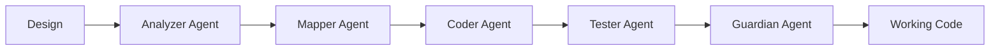
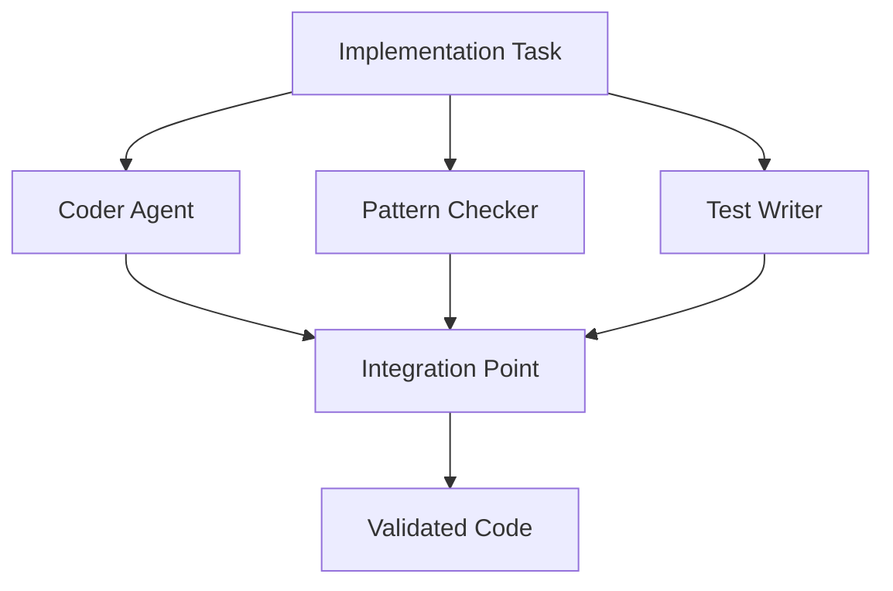
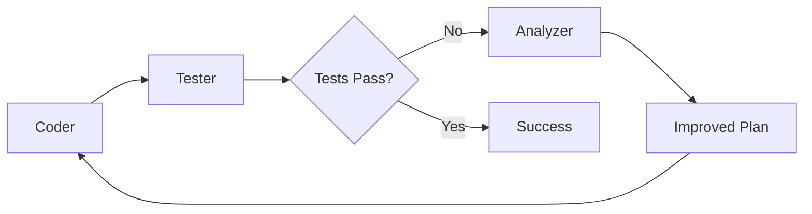

# Intelligent Coder Agent System Proposal

**Date:** 2025-09-11  
**Author:** Development Team  
**Status:** PROPOSAL

---

## Executive Summary

This proposal addresses the fundamental challenge of creating AI coding agents that can implement designs without breaking existing architecture. Based on our retrospective analysis, we propose a multi-tiered agent system with verification protocols, incremental development practices, and architectural awareness.

---

## Problem Statement

Current issues with AI-assisted coding:
1. **Context Loss**: Agents lack understanding of existing architecture
2. **Assumption-Based Coding**: Agents guess rather than verify
3. **Big Bang Changes**: Large changes that break everything
4. **No Testing Integration**: Code delivered without validation
5. **Architecture Blindness**: New code doesn't follow existing patterns

---

## Proposed Solution: Three-Tier Agent Architecture

### Tier 1: Understanding Agents

#### 1.1 Architecture Mapper Agent
```yaml
purpose: Understand codebase structure and patterns
capabilities:
  - Map file organization
  - Identify design patterns
  - Document conventions
  - Track dependencies

output:
  architecture_map:
    patterns: [MVC, Command, Observer]
    conventions: 
      naming: snake_case
      imports: absolute
    critical_paths: [main.py, ui/main_window.py]
```

#### 1.2 Design Analyzer Agent
```yaml
purpose: Parse and understand design documents
capabilities:
  - Extract requirements
  - Identify success criteria
  - Map design to architecture
  - Flag potential conflicts

output:
  design_analysis:
    requirements: [list]
    architecture_fit: score
    risks: [list]
    implementation_approach: strategy
```

### Tier 2: Implementation Agents

#### 2.1 Safe Coder Agent
```yaml
purpose: Write code that doesn't break
protocol:
  - Read before write
  - Verify before assume
  - Test after every change
  - Commit only working code

constraints:
  max_lines_per_change: 10
  test_required: true
  rollback_on_failure: true
```

#### 2.2 Pattern Follower Agent
```yaml
purpose: Ensure new code follows existing patterns
checks:
  - Import style matches
  - Naming conventions followed
  - Architecture patterns respected
  - Error handling consistent
```

### Tier 3: Validation Agents

#### 3.1 Test Runner Agent
```yaml
purpose: Validate all changes
tests:
  - Smoke: App starts
  - Unit: Functions work
  - Integration: Features integrate
  - Regression: Nothing broke
```

#### 3.2 Architecture Guardian Agent
```yaml
purpose: Prevent architectural decay
validates:
  - No circular dependencies
  - Separation of concerns maintained
  - Patterns consistently applied
  - No code duplication
```

---

## Context Management System

### Context Database Structure
```python
context = {
    "architecture": {
        "patterns": ["Command", "MVC", "Observer"],
        "file_structure": {...},
        "dependencies": {...},
        "conventions": {...}
    },
    "current_state": {
        "working_branch": "main",
        "app_starts": True,
        "tests_passing": True,
        "recent_changes": [...]
    },
    "design_requirements": {
        "feature_x": {...},
        "constraints": [...],
        "success_criteria": [...]
    },
    "implementation_history": {
        "what_worked": [...],
        "what_failed": [...],
        "patterns_to_follow": [...],
        "antipatterns_to_avoid": [...]
    }
}
```

### Context Passing Protocol
```yaml
agent_communication:
  from: Architecture Mapper
  to: Safe Coder
  context:
    - file_paths
    - class_types (dataclass vs regular)
    - import_patterns
    - naming_conventions
    
  from: Safe Coder
  to: Test Runner
  context:
    - files_changed
    - functions_added
    - expected_behavior
    - test_commands
```

---

## Implementation Strategies

### Strategy 1: Incremental Development Protocol

```python
class IncrementalDevelopment:
    def __init__(self):
        self.max_lines = 10
        self.checkpoints = []
    
    def implement_feature(self, design):
        steps = self.break_into_increments(design)
        
        for step in steps:
            checkpoint = self.create_checkpoint()
            code = self.write_code(step, max_lines=10)
            
            if self.test_passes(code):
                self.commit(code)
                self.checkpoints.append(checkpoint)
            else:
                self.rollback(checkpoint)
                raise ImplementationError(f"Step failed: {step}")
```

### Strategy 2: Verification-First Approach

```python
class VerificationFirst:
    def before_using_class(self, class_name):
        # Check structure
        structure = self.analyze_class_structure(class_name)
        
        # Verify type
        if structure.is_dataclass:
            return self.create_dataclass_instance()
        elif structure.is_abstract:
            return self.create_concrete_implementation()
        else:
            return self.create_regular_instance()
    
    def before_importing(self, module):
        # Find correct path
        actual_path = self.find_module_path(module)
        
        # Verify it works
        if self.test_import(actual_path):
            return actual_path
        else:
            raise ImportError(f"Cannot import {module}")
```

### Strategy 3: Pattern-Based Implementation

```python
class PatternBasedCoding:
    def __init__(self, codebase_patterns):
        self.patterns = codebase_patterns
    
    def implement_command(self, design):
        # Use existing command pattern
        pattern = self.patterns.get("command")
        
        if pattern.uses_handlers:
            return self.create_handler_function()
        elif pattern.uses_classes:
            return self.create_command_class()
        else:
            raise UnknownPattern("Command pattern not recognized")
```

---

## Multi-Agent Orchestration

### Sequential Pipeline


### Parallel Verification


### Feedback Loop System


---

## Agent Collaboration Patterns

### Pattern 1: Specialist Agents
```yaml
agents:
  ui_specialist:
    knows: [PySide6, Qt, widgets]
    handles: [UI components, layouts, events]
  
  backend_specialist:
    knows: [services, data, APIs]
    handles: [business logic, data flow]
  
  test_specialist:
    knows: [pytest, mocking, coverage]
    handles: [test creation, validation]
```

### Pattern 2: Review Chain
```yaml
review_chain:
  1. Coder: Implements feature
  2. Reviewer: Checks code quality
  3. Architect: Validates design alignment
  4. Tester: Ensures functionality
  5. Deployer: Integrates safely
```

### Pattern 3: Pair Programming Simulation
```yaml
pair_programming:
  driver:
    role: Write code
    focus: Implementation details
  
  navigator:
    role: Review and guide
    focus: Architecture and patterns
  
  interaction:
    - Driver writes 10 lines
    - Navigator reviews
    - Both discuss approach
    - Iterate
```

---

## Context Persistence Strategy

### 1. Project Knowledge Base
```python
knowledge_base = {
    "patterns": {
        "command": {
            "type": "function_handler",
            "example": "core/commands/builtin/file_commands.py",
            "do": ["use handlers", "return CommandResult"],
            "dont": ["inherit from Command", "use classes"]
        }
    },
    "gotchas": {
        "imports": {
            "ServiceLocator": "services.service_locator",
            "NOT": "core.services.locator"
        }
    },
    "architecture_decisions": [
        "ADR-001-command-registry-separation.md"
    ]
}
```

### 2. Learning System
```python
class LearningSystem:
    def record_success(self, approach, context):
        self.successful_patterns.append({
            "approach": approach,
            "context": context,
            "timestamp": now()
        })
    
    def record_failure(self, approach, error, fix):
        self.failures.append({
            "approach": approach,
            "error": error,
            "fix": fix,
            "lesson": self.extract_lesson(error, fix)
        })
    
    def suggest_approach(self, task):
        similar = self.find_similar_tasks(task)
        return self.successful_patterns.get(similar)
```

### 3. Context Transfer Protocol
```yaml
context_transfer:
  on_agent_start:
    - Load project knowledge base
    - Load recent learning
    - Check current state
  
  on_task_complete:
    - Update knowledge base
    - Record what worked
    - Document new patterns
  
  on_failure:
    - Analyze what went wrong
    - Update gotchas
    - Add to prevention rules
```

---

## Implementation Safeguards

### 1. Pre-Flight Checks
```python
def pre_flight_checks():
    checks = {
        "app_starts": test_app_starts(),
        "tests_pass": run_tests(),
        "branch_clean": check_git_status(),
        "dependencies_available": verify_deps()
    }
    
    if not all(checks.values()):
        raise EnvironmentError("Pre-flight checks failed")
```

### 2. Continuous Validation
```python
def continuous_validation():
    while coding:
        every_n_lines(10):
            if not app_still_starts():
                rollback()
                analyze_what_broke()
```

### 3. Atomic Commits
```python
def atomic_development():
    with git_transaction():
        make_change()
        if tests_pass():
            commit()
        else:
            rollback()
```

---

## Success Metrics

### Quantitative Metrics
1. **Build Success Rate**: >95% of commits have working build
2. **Test Coverage**: Maintained or improved
3. **Bug Introduction Rate**: <1 per feature
4. **Rollback Frequency**: <5% of changes
5. **Time to Working Feature**: Predictable within 20%

### Qualitative Metrics
1. **Code Consistency**: Follows existing patterns
2. **Architecture Integrity**: No degradation
3. **Developer Confidence**: Can trust agent output
4. **Maintenance Burden**: Reduced, not increased
5. **Knowledge Transfer**: Patterns documented

---

## Phased Rollout Plan

### Phase 1: Single Agent with Protocols (Week 1-2)
- Implement Safe Coder agent
- Enforce verification protocols
- Test on small features
- Measure success rate

### Phase 2: Dual Agent System (Week 3-4)
- Add Architecture Mapper
- Implement context passing
- Test on medium features
- Refine protocols

### Phase 3: Full Pipeline (Week 5-6)
- Deploy all agents
- Implement orchestration
- Test on complex features
- Optimize performance

### Phase 4: Learning System (Week 7-8)
- Add knowledge persistence
- Implement learning from failures
- Create pattern library
- Continuous improvement

---

## Risk Mitigation

### Risk 1: Over-Engineering
**Mitigation**: Start simple, add complexity only when needed

### Risk 2: Context Overload
**Mitigation**: Limit context to relevant information only

### Risk 3: Agent Conflicts
**Mitigation**: Clear role boundaries and decision authority

### Risk 4: Performance Degradation
**Mitigation**: Time box agent operations, fallback to manual

### Risk 5: False Confidence
**Mitigation**: Always require human review for critical changes

---

## Alternative Approaches Considered

### 1. Single Super Agent
**Pros**: Simpler, unified context  
**Cons**: Too complex, hard to debug  
**Decision**: Rejected - violates single responsibility

### 2. Human-in-the-Loop Always
**Pros**: Maximum safety  
**Cons**: Slow, defeats automation purpose  
**Decision**: Partial - only for critical decisions

### 3. Test-Driven Agent
**Pros**: Quality guaranteed  
**Cons**: Requires test-first culture  
**Decision**: Optional - available but not mandatory

---

## Conclusion

The proposed multi-agent system addresses our core challenges:

1. **Context Loss** → Persistent knowledge base
2. **Assumptions** → Verification protocols
3. **Big Bang Changes** → Incremental development
4. **No Testing** → Integrated validation
5. **Architecture Blindness** → Pattern awareness

By implementing this system, we can achieve:
- **Reliable** code generation that doesn't break
- **Consistent** implementation following patterns
- **Safe** development with rollback capability
- **Learning** system that improves over time

The key insight: **Multiple specialized agents with clear protocols outperform a single complex agent**.

---

## Next Steps

1. Review and approve proposal
2. Implement Phase 1 Safe Coder agent
3. Create initial knowledge base
4. Test on real features
5. Iterate based on results

---

## Appendices

### A. Example Agent Prompt
```
You are a Safe Coder Agent. Your job is to implement features without breaking existing code.

RULES:
1. Read before write
2. Verify before assume
3. Test after every change
4. Maximum 10 lines per step

CONTEXT:
- Architecture: [provided]
- Patterns: [provided]
- Current state: [provided]

TASK: [specific task]

Execute following the rules. Report any issues immediately.
```

### B. Verification Checklist
- [ ] Class structure verified
- [ ] Import paths confirmed
- [ ] Pattern identified
- [ ] Dependencies checked
- [ ] Tests planned

### C. Success Story Template
```markdown
Feature: [Name]
Agent: [Which agent]
Time: [Duration]
Result: [Success/Failure]
Lessons: [What we learned]
```

---

*"The best code is the code that works, consistently, every time."*